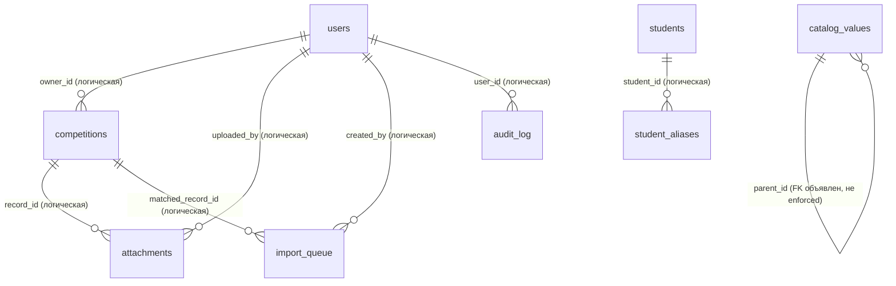

# Модель данных: текущее состояние

> Снимок актуален на **2026-09-20**, ветка **`feature/student-reconciliation`**
> (Student Identity v1, Phase 1 — фундамент «Студентов»; Phase 2 — сопоставление
> данных; см. раздел «Личность: легаси и новое»). Документ описывает
> **CURRENT STATE** — как база устроена и работает прямо сейчас, а не целевую
> архитектуру. История того, почему так решили, — в
> [data-model-decisions.md](data-model-decisions.md); этот документ —
> справочник «что есть». Производственная база до деплоя этой ветки остаётся
> на ревизии **88ce6d7** (таблиц «Студентов» в проде ещё нет — они появятся
> при первом старте новой ревизии, см. «Миграции»).

Цель: новый инженер должен найти здесь ответ на любой вопрос о текущей схеме
и данных, не читая код. Все примеры синтетические.

## Как хранится база

- SQLite, файл `./data/competitions.sqlite3` (путь настраивается
  `DATABASE_PATH`), режим `journal_mode=WAL`.
- `PRAGMA foreign_keys` **везде выключен** — приложение его никогда
  не включает. Единственный объявленный в DDL внешний ключ
  (`catalog_values.parent_id`) — декларативный, без enforcement.
- `user_version = 0`, таблицы версий нет. Миграции — «самомиграция» при
  каждом старте: `_create_schema()` в `src/storage/sqlite.py` выполняет
  `CREATE TABLE IF NOT EXISTS` + аддитивные `ALTER TABLE ADD COLUMN`
  (полный список — в разделе «Миграции»).
- Одно соединение к БД + `threading.RLock` вокруг всех обращений
  (`check_same_thread=False`).
- Сверка с производственной базой (2026-09-20, read-only): **расхождений
  схемы нет** — DDL прода объект-за-объектом эквивалентен свежей инициализации
  той же ревизии; единственные текстовые отличия — безвредные артефакты
  накатанных `ALTER TABLE ADD COLUMN`.
- Объёмы прод-снимка (2026-09-20, только чтение): competitions 14, users 7,
  attachments 5, audit_log 207, calendar_events 2, catalog_values 22,
  levels 2, custom_fields 2, field_settings 10, import_queue 0
  (таблиц `students`/`student_aliases` в проде ещё нет — до деплоя
  `feature/student-foundation`).

## ER-диаграмма

Связи между таблицами — логические (в приложении), а не SQL-ограничения:
`PRAGMA foreign_keys` выключен, каскадов и ограничений целостности на уровне
БД нет. Исключение — самоссылка `catalog_values.parent_id`, объявленная
в DDL, но тоже не enforced.

Отдельная прикладная связь, которой нет в SQL:
`competitions.student_id = sha256(ФИО)`, где ФИО берутся из
`users.profile_data.student_name` и `users.name_aliases`. Хеши считаются
на лету (в приложении), в БД не хранятся — подробнее в разделе
«Как устроена личность сегодня». Колонки `competitions.student_ref_id`
и `users.student_ref_id` (ссылки на `students.id`) с Phase 2 наполняются
вручную администратором через сопоставление; с импорта участников события
`competitions.student_ref_id` также пишется в НОВЫЕ записи при явном
выборе/создании карточки — см. раздел
«Личность: легаси и новое».

## Таблицы

Общее: первичный ключ — `INTEGER PRIMARY KEY AUTOINCREMENT` (кроме
`field_settings` и `app_settings`, где ключ — текстовый). Явные индексы
в схеме: два частичных уникальных индекса `catalog_values` (см. ниже)
и два обычных индекса ссылок participation-identity у `competitions` —
`idx_competitions_calendar_event_id`, `idx_competitions_student_ref_id`
(Event Model, Wave 1 P0; не UNIQUE — уникальность связи управляется
приложением); остальных индексов нет.

### 1. `competitions` — записи участий

Основная таблица: одна строка = одно участие одного студента в одном
соревновании.

| Колонка | Тип / ограничение | Смысл |
|---|---|---|
| `id` | PK AUTOINCREMENT | идентификатор записи |
| `student_id` | TEXT NOT NULL | `sha256(strip(ФИО))`, hex; ключ личности (см. ниже) |
| `student_name` | TEXT NOT NULL | ФИО открытым текстом (исторический факт) |
| `student_sex` | TEXT NOT NULL | пол |
| `institute` | TEXT NOT NULL | институт на момент соревнования |
| `group` | TEXT NOT NULL | группа (колонка в кавычках — зарезервированное слово) |
| `course` | INTEGER NOT NULL | курс; фактически `int \| str` — при текстовом типе поля хранит строку (кейс «Выпускник») |
| `sport` | TEXT NOT NULL | вид спорта |
| `date` | TEXT NOT NULL | дата соревнования, ISO; **начало** диапазона |
| `date_to` | TEXT NULL | конец диапазона; NULL = однодневное |
| `level` | TEXT NOT NULL | уровень; приводится к нижнему регистру и канонизируется |
| `name` | TEXT NOT NULL | название соревнования |
| `position` | INTEGER NOT NULL | место; 0 = «без результата» (при текстовом типе поля — строка) |
| `created_at` | TEXT NOT NULL | время создания, UTC |
| `extra_data` | TEXT NOT NULL DEFAULT `'{}'` | JSON значений кастомных полей, ключ = `custom_fields.key` |
| `review_status` | TEXT NOT NULL DEFAULT `'approved'` | `approved` / `pending` / `rejected` |
| `owner_id` | INTEGER NULL | логический FK `users.id`; обнуляется при удалении аккаунта |
| `review_comment` | TEXT NOT NULL DEFAULT `''` | комментарий модератора при отклонении |
| `student_ref_id` | INTEGER NULL | логический FK `students.id`; существующие строки — NULL. Наполняется вручную через сопоставление (Phase 2) и при явном выборе/создании карточки в новых записях — ручное добавление участника события и импорт участников события (см. «Личность: легаси и новое»). С Phase 3 runtime читает её: видимость и права кабинета атлета в режиме dual/ref (см. «Режим идентификации») |
| `discipline` | TEXT NULL | дисциплина участия (Event Model, Wave 1 P0/P1 → P5a): заполняется Excel-импортом реестра (опциональная колонка «Дисциплина»), решениями очереди конфликтов и импортом участников события (фиксированная колонка P4 — identity-часть участия вместе с карточкой/ФИО), входит в полный ключ дубля (нормализованная), отдаётся фиксированной колонкой выгрузки; обычная правка записи сохраняет значение (P2, контракт QA O1). Существующие строки — NULL |
| `result` | TEXT NULL | результат участия (Event Model, Wave 1 P0/P1 → P5a): отдаётся фиксированной колонкой выгрузки «Результат»; импортом реестра не пишется (значение файла идёт только в кастом-поло с тем же label, если активно); импорт участников события пишет фиксированной колонкой «Результат» (P4, informational); restricted-обновление из предпросмотра импорта (P4) меняет только `position`/`result`; обычная правка записи сохраняет значение (P2) |
| `calendar_event_id` | INTEGER NULL | логический FK `calendar_events.id` (Event Model, Wave 1 P0/P1 → P2). Проставляется стартовым backfill'ем по однозначному пресету (см. «Миграции») и всеми event-workflows (ручное добавление участника, импорт участников); общий `update_competition` её сохраняет. Явное связывание NULL-записи со страницы записи — P5b (см. «Явное связывание записи с событием»). P2: у связанных записей поля `name/date/date_to/sport/level` принадлежат событию (edit-sync, реестр их не правит). Не UNIQUE: одно событие — много участий |

Кто создаёт строки (везде через модель `Competition`):

- `POST /` — Excel-импорт: статус `approved`, `owner_id` = импортер;
- `POST /competition` — ручной ввод: атлет → `pending`,
  модератор (admin/editor) → `approved`;
- `POST /calendar/<id>/participants` — добавление участника события:
  `approved`, `calendar_event_id` = событие (P2); при явном выборе карточки
  студента в подсказке ФИО запись получает `student_ref_id`;
- импорт участников события календаря (`/calendar/<id>/participants/import`):
  `approved`, `owner_id` = импортер, `student_ref_id` выбранной/созданной
  карточки и `calendar_event_id` события (P2, см. `calendar_events`);
- admin-решения по очереди импорта: accept/edit → `approved`,
  `owner_id` = автор импорта;
- `scripts/migrate_mongo_to_sqlite.py` — разовая миграция: `approved`,
  `owner_id` NULL.

### 2. `users` — аккаунты

| Колонка | Тип / ограничение | Смысл |
|---|---|---|
| `id` | PK AUTOINCREMENT | идентификатор аккаунта |
| `username` | TEXT NOT NULL UNIQUE | логин; без `:` и управляющих символов |
| `password_hash` | TEXT NOT NULL | `scrypt$N$r$p$salt_hex$digest_hex`, N=16384, r=8, p=1, dklen=32; параметры хранятся в самой строке |
| `role` | TEXT NOT NULL | `admin` / `editor` / `viewer` / `athlete` |
| `active` | INTEGER NOT NULL DEFAULT 1 | отключённая учётка не пускает вход |
| `pwd_ver` | INTEGER NOT NULL DEFAULT 0 | инкремент при смене пароля — ревокация активных сессий |
| `profile_data` | TEXT NOT NULL DEFAULT `'{}'` | JSON `{student_name, student_sex, institute, group, course}` (только непустые ключи), открытый текст; потребляется только ролью athlete |
| `name_aliases` | TEXT NOT NULL DEFAULT `'[]'` | JSON-массив ФИО открытым текстом; список только растёт |
| `last_login_at` | TEXT NULL | последний успешный вход |
| `last_seen_at` | TEXT NULL | активность; обновляется не чаще раза в 60 с (троттлинг) |
| `student_ref_id` | INTEGER NULL | логический FK `students.id`; существующие строки — NULL, наполняется вручную через сопоставление (Phase 2). С Phase 3 runtime читает её: видимость и права кабинета атлета в режимах dual/ref (см. «Режим идентификации») |

Кто создаёт строки: посев при старте из `AUTH_*`-переменных окружения
(`seed_users`; viewer опционален — при пустых переменных не создаётся)
и `POST /admin/users`. «Аккаунт без пароля» сегодня невозможен:
`password_hash NOT NULL`, а `verify_password` строго парсит scrypt-формат —
пустой/чужой хеш просто не пройдёт проверку.

### 3. `levels` — уровни соревнований

| Колонка | Тип / ограничение | Смысл |
|---|---|---|
| `id` | PK AUTOINCREMENT | |
| `name` | TEXT NOT NULL UNIQUE | значение; хранится в нижнем регистре |
| `sort_order` | INTEGER NOT NULL DEFAULT 0 | порядок в списках |
| `active` | INTEGER NOT NULL DEFAULT 1 | скрытое не показывается в подсказках |

Посев значений «внутривузовские»/«межвузовские» выполняется только при
пустой таблице. Управление — admin CRUD; при импорте справочник
синхронизируется автоматически:
`INSERT OR IGNORE ... SELECT DISTINCT level FROM competitions`.

### 4. `catalog_values` — справочники значений

Единая таблица для трёх справочников: категории различаются колонкой
`category`.

| Колонка | Тип / ограничение | Смысл |
|---|---|---|
| `id` | PK AUTOINCREMENT | |
| `category` | TEXT NOT NULL | `sport` / `institute` / `group` |
| `value` | TEXT NOT NULL | значение (текст) |
| `parent_id` | INTEGER NULL, REFERENCES `catalog_values(id)` | для `group` — родительский институт; **единственный объявленный FK в схеме**, enforcement выключен |
| `active` | INTEGER NOT NULL DEFAULT 1 | скрытое не показывается в подсказках |
| `created_at` | TEXT NOT NULL | |

Единственные явные индексы схемы — два частичных уникальных:

- `idx_catalog_values_flat (category, value) WHERE parent_id IS NULL` —
  плоские значения (спортив, институты);
- `idx_catalog_values_child (category, parent_id, value) WHERE parent_id IS NOT NULL` —
  дочерние; одноимённые группы разных институтов сосуществуют.

Наполнение — `INSERT OR IGNORE` из записей, импорта и admin-роутов;
скрытые (active=0) значения при повторном появлении в записях не «оживают».
Справочники — только подсказки (datalist) в формах: значения в существующих
записях не валидируются и не перезаписываются.

### 5. `custom_fields` — кастомные поля

Определения дополнительных колонок записей. Управление — только admin.
Сами значения хранятся не здесь, а в `competitions.extra_data[key]`.

| Колонка | Тип / ограничение | Смысл |
|---|---|---|
| `id` | PK AUTOINCREMENT | |
| `key` | TEXT NOT NULL UNIQUE | ключ; нормализуется из label |
| `label` | TEXT NOT NULL | отображаемое название |
| `field_type` | TEXT NOT NULL DEFAULT `'text'` | `text` / `number` / `date` / `url` |
| `required` | INTEGER NOT NULL DEFAULT 0 | обязательность при вводе/импорте |
| `show_in_table` | INTEGER NOT NULL DEFAULT 1 | показ в таблице |
| `show_in_export` | INTEGER NOT NULL DEFAULT 1 | показ в выгрузках |
| `show_in_template` | INTEGER NOT NULL DEFAULT 1 | показ в пустом шаблоне импорта |
| `sort_order` | INTEGER NOT NULL DEFAULT 0 | порядок |
| `active` | INTEGER NOT NULL DEFAULT 1 | отключённое поле скрывается |
| `link_target` | TEXT NULL | у `url`-полей: ключ колонки, которую значение гиперссылает; догоняющая миграция |

### 6. `field_settings` — настройки базовых полей

«Лёгкий реестр полей»: тип и обязательность десяти базовых колонок записи.

| Колонка | Тип / ограничение | Смысл |
|---|---|---|
| `key` | TEXT PRIMARY KEY | имя базового поля (10 штук: student_name, student_sex, institute, group, sport, date, level, name, position, course) |
| `value_type` | TEXT NOT NULL DEFAULT `'text'` | `text` / `number` |
| `required` | INTEGER NOT NULL DEFAULT 0 | обязательность |

`student_name` и `date` принудительно обязательны в коде
(`ALWAYS_REQUIRED_BASE_FIELDS`) — настройка их не ослабляет. Дефолты
дописываются `INSERT OR IGNORE` при каждом старте; изменение — upsert
из `POST /admin/fields/base`.

### 7. `attachments` — вложения

| Колонка | Тип / ограничение | Смысл |
|---|---|---|
| `id` | PK AUTOINCREMENT | |
| `record_id` | INTEGER NOT NULL | логический FK `competitions.id` |
| `filename` | TEXT NOT NULL | исходное имя файла от пользователя |
| `stored_name` | TEXT NOT NULL | имя на диске: `uuid4().hex` + расширение |
| `content_type` | TEXT NOT NULL | `pdf` / `png` / `jpeg`; проверяется и расширение, и сигнатура (magic bytes) |
| `size` | INTEGER NOT NULL | размер в байтах (лимит 5 МБ на уровне приложения) |
| `uploaded_by` | INTEGER NULL | логический FK `users.id` |
| `created_at` | TEXT NOT NULL | |

Файлы лежат в `data/files/<record_id>/<stored_name>`. Создание —
`POST /competition/<id>/attachments` (роли с правом записи, владелец
записи). С ревизии 88ce6d7 удаление записи удаляет и строки вложений
(одной транзакцией с записью), и файлы на диске (best-effort).

### 8. `audit_log` — журнал аудита

| Колонка | Тип / ограничение | Смысл |
|---|---|---|
| `id` | PK AUTOINCREMENT | |
| `created_at` | TEXT NOT NULL | |
| `user_id` | INTEGER NULL | логический FK `users.id`; может быть NULL |
| `username` | TEXT NOT NULL | логин текстом — переживает удаление аккаунта |
| `action` | TEXT NOT NULL | код события (ниже) |
| `details` | TEXT NOT NULL DEFAULT `''` | параметры события |

Таблица append-only: `UPDATE`/`DELETE` в коде отсутствуют. Фиксируемые
действия:

- `login_success` / `login_failed` — входы;
- `password_changed` — смена пароля;
- `record_approved` (в т.ч. авто-подтверждение при правке модератора) /
  `record_rejected` — решения модерации;
- `record_deleted` — удаление записи `{record_id, student_name}`
  (2026-09-22, включая удаление участника со страницы события календаря);
- `students_merged` — merge ФИО;
- `alias_added` — привязка псевдонима;
- `user_deleted` — удаление аккаунта;
- `import_conflict_resolved` — решения по очереди импорта
  (accepted/skipped/replaced, с diff);
- `catalog_value_renamed` / `catalog_value_deleted` — справочники;
- `catalog_group_moved` — перенос группы в другой институт `{group,
  old_institute, new_institute, students_updated, competitions_updated,
  group_id}` (2026-09-22);
- `calendar_event_deleted` — удаление события календаря;
- `calendar_event_edited` — правка события календаря (P2) `{event_id,
  name/date/date_to/sport/level как {old,new}, synced_participations}` —
  вместе с синхронизацией связанных записей;
- `calendar_regulation_uploaded` `{event_id, event_name, filename,
  replaced}` / `calendar_regulation_deleted` `{event_id, event_name,
  filename}` — файл положения события календаря (2026-09-22);
- `calendar_event_created` — создание события календаря (P5b, со страницы
  записи): `{event_id, name, date, date_to, sport, level, url,
  linked_record_id, source: 'registry'}` (создание из самого календаря
  `/calendar/new` не аудируется);
- `participation_linked` — явное связывание записи с событием (P5b):
  `{record_id, student_name, event_id, event_name, changes:
  {поле: {old, new}} по 5 event-owned полям}`; при связывании с только
  что созданным событием — дополнительно `event_created: true`;
- `participation_batch_linked` — массовое связывание (P5b, admin):
  `{linked, skipped, items: [{record_id, event_id, event_name}]}`;
- `student_created` / `student_updated` (с diff old→new) /
  `student_deactivated` / `student_activated` / `student_alias_added` /
  `student_alias_removed` — карточки студентов (Phase 1);
- `competition_linked_to_student` / `student_records_bulk_linked` /
  `competition_unlinked_from_student` / `competition_relinked` /
  `user_linked_to_student` / `user_unlinked_from_student` /
  `user_relinked_to_student` — сопоставление данных (Phase 2);
  `student_created` из сопоставления дополнительно несёт `source`
  (`reconciliation-record` / `reconciliation-user`);
- `student_import_completed` — итог импорта студентов `{created,
  reused_existing, skipped, errors, total}`; `student_created` из импорта
  несёт `source: excel-import` (Phase 2.5);
- `event_participant_imported` `{event_id, student_ref_id}` — каждое участие,
  созданное импортом участников события; `student_created` из этого импорта
  несёт `source: event-participant-import`; `event_participant_updated`
  `{event_id, record_id, position/result как {old, new}}` — restricted-обновление
  места/результата существующего участия из предпросмотра импорта (P4);
  `event_participants_import_completed`
  `{event_id, event_name, counters}` — итоги импорта при завершении
  (содержимое файла в аудит не пишется); counters с P4: `added / updated /
  kept / skipped / already_exists / file_duplicates / errors / total`;
- `field_settings_changed` — настройки базовых полей;
- `identity_mode_changed` — переключение режима идентификации кабинета
  атлета (P3) `{old, new, hash_only_visible}` — только admin, только
  успешный переход через guard (отказ guard'а не аудируется);
- `db_wiped` / `pre_wipe_archive_created` — очистка базы и страховочный
  архив перед ней;
- `backup_created` — бэкап (по таймеру или вручную).

### 9. `calendar_events` — календарь соревнований

Событие календаря — **пресет** для будущих записей и владелец event-owned
полей их участий (P2), а не контейнер участников: участников событие не
хранит — это записи реестра со ссылкой `calendar_event_id`.

| Колонка | Тип / ограничение | Смысл |
|---|---|---|
| `id` | PK AUTOINCREMENT | |
| `name` | TEXT NOT NULL | название |
| `date` | TEXT NOT NULL | начало, ISO |
| `date_to` | TEXT NULL | конец; NULL = однодневное |
| `level` | TEXT NOT NULL DEFAULT `''` | |
| `sport` | TEXT NOT NULL DEFAULT `''` | |
| `url` | TEXT NOT NULL DEFAULT `''` | только `http://` или `https://` (с 88ce6d7) |
| `created_at` | TEXT NOT NULL | |
| `regulation_filename` | TEXT NULL | исходное имя файла положения для скачивания (2026-09-22) |
| `regulation_stored_name` | TEXT NULL | служебное имя файла в `data/files/calendar/<id>/`; обе NULL = файла нет |

Участники события — записи реестра со ссылкой `calendar_event_id`
(Event Model, Wave 1 P2, id-first): состав участников читается по явной
связи, а не по совпадению пресета. Добавление участника создаёт обычную
`approved`-запись с пресетом события (`position = 0`, «ждёт результата»)
и сразу пишет `calendar_event_id` — все event-workflows (ручное добавление
`POST /calendar/<id>/participants`, все три пути импорта участников:
row-add / create-student / bulk-commit). Подсказки ФИО при вводе участника —
объединение карточек студентов (`students`, только активные, находятся и
без истории участий) и легаси-известных атлетов (профили + последняя
запись); при точном совпадении ФИО показывается только карточка. Явный
выбор карточки заполняет пустые пол/институт/группу/курс и записывает в
новую запись `student_ref_id`; правка ФИО после выбора молча сбрасывает
связь (инлайн-правка существующей записи связь не трогает).

**Edit-sync (P2):** событие — владелец полей участия
`name/date/date_to/sport/level`. Правка события
(`POST /calendar/<id>/edit`, `update_calendar_event`) одной транзакцией
обновляет событие И переносит эти 5 полей во все связанные записи
(`WHERE calendar_event_id = ?`; сбой — откат всего). Student-поля, место,
дисциплина, результат, custom-поля синхронизацией не затрагиваются.
NULL-legacy-строки без ссылки не синхронизируются. Аудит —
`calendar_event_edited` (old/new по 5 полям + `synced_participations`).

**Реестр (P2):** у связанной записи поля «Название/Вид спорта/Дата/Уровень»
не редактируются из реестра — только со страницы события. Инлайн-правка
рендерит их заблокированными (кнопка несёт `data-calendar-event-id`),
сервер `POST /competition/<id>` берёт их из существующей записи — подделка
формы ничего не меняет. Название в таблице — ссылка на страницу
соревнования (атлету — простой текст: страница события ему недоступна).
NULL-записи правятся прежним путём — все поля из формы.

**Импорт участников события** (`/calendar/<id>/participants/import`,
admin/editor; создание карточек — только admin):

- Excel с обязательной колонкой только «ФИО»; опциональны
  «Пол»/«Институт»/«Группа»/«Курс»/«Место» + фиксированные P4
  «Дисциплина»/«Результат» (после «Места»; дисциплина — identity-часть
  участия, результат — informational-колонка в базовую `result` записи)
  + активные кастомные поля с `show_in_template`, кроме url-полей
  (ссылки уровня записи/события к снимку участия не относятся) и кроме
  коллизии label с фиксированными «Дисциплина»/«Результат» (P5a-exception,
  P4: колонка файла одна, значение идёт в базовые колонки записи; сами
  поля в реестре/обычном импорте-экспорте остаются); лишние колонки
  игнорируются; пустой шаблон скачивается; лимит 5000 строк.
  Название/даты/уровень/вид спорта в файле НЕ нужны — пресет берётся из
  события;
- разбор → staging-сессия в памяти (TTL 2 часа, одна на пользователя,
  привязана к событию) → предпросмотр; в БД не пишется ничего до
  подтверждения;
- приоритет снимка участия: ЯВНОЕ значение Excel > карточка Student
  (явно выбранная или — пока не сброшена кнопкой «Без карточки» —
  единственный точный кандидат; используется для автозаполнения пустых
  пол/институт/группа/курс в предпросмотре) > пусто;
  карточка-мастер не обновляется; если институт пуст и группа заполнена —
  подсказки группы→института (карта файла, затем справочник, только
  чтение); пустое «Место» → `position = 0` («ждёт результата»); финальная
  валидация строки — `build_competition` (настройки полей, обязательные
  кастомные поля);
- кандидаты — только ПРЕДЛОЖЕНИЯ (те же правила, что в сопоставлении:
  точное совпадение strip + casefold с `full_name`/псевдонимом активной
  карточки; без fuzzy/ё-е/транслитерации); сопоставление с карточкой
  импорт НЕ блокирует: единственный точный кандидат подбирается
  автоматически (виден первой строкой «найден автоматически», источник
  автозаполнения), явный выбор помечается «выбрана вручную»; сбросить
  карточку можно кнопкой «Без карточки» (явное решение — участие без
  связи); тёзки (≥2) и 0 кандидатов не подбираются автоматически —
  участие добавляется с `student_ref_id IS NULL` и сопоставляется позже
  существующим механизмом (`/admin/people/reconcile`); правка ФИО строки
  сбрасывает ОБА решения по карточке — явный выбор и «без карточки»
  (устаревшее решение не переносится молча, для нового ФИО кандидаты
  подбираются заново);
- **P4: строгий repeat-safe дедуп** — повтор уже существующего участия
  НЕ создаётся. Ключи уникальности: MATCHED-строка (карточка определена)
  — identity `(event, student_ref_id, нормализованная дисциплина)`;
  CARDLESS-строка — контент-ключ `(event, нормализованное ФИО,
  нормализованная дисциплина)` + полный контент
  (пол/институт/группа/курс/место/результат/custom). Нормализация —
  единая с серверной проверкой (`participation_content_key` storage):
  тексты strip+casefold, дисциплина `normalize_discipline_for_dedup`,
  0/пустое место-курс = «нет значения». Существующие участия читаются с
  legacy-фолбэком: `discipline`/`result` NULL → значение активного кастома
  с тем же label из `extra_data` (записи до P4, только чтение).
  Классификация пересчитывается на каждом рендере:
  - MATCHED, участия с той же identity нет → «готова»; есть и место+
    результат равны → производный статус «уже существует» (группа
    «Решено», без действий, в БД ничего); отличаются →
    update-candidate («существует — можно обновить» + дифф место/результат
    старое→новое, «—» для пустых) — построчные действия
    «Обновить существующее» (restricted-update только `position`/`result`,
    `WHERE id + calendar_event_id` — снимок, custom-поля, вложения,
    `student_ref_id` и связь с событием недостижимы; аудит
    `event_participant_updated`) и «Оставить существующее» (статус kept,
    без изменений); в bulk-батч update-candidate НЕ входит;
  - CARDLESS: точная копия контента существующего участия → «уже
    существует»; контент-ключ совпал, контент другой → «возможный дубль»
    — «Пропустить (default)» / «Добавить как новое» (явное решение);
    обновить cardless-участие из импорта НЕЛЬЗЯ (кнопок и роута нет);
    вставки cardless-строк всегда `student_ref_id IS NULL` (auto-ref
    никогда не подставляется);
  - повторы В ФАЙЛЕ: точная копия строки (casefold, включая
    дисциплину/результат/custom) — производный пропуск «дубликат в файле
    — пропускается» (якорь — первая строка группы по номеру; флаг не
    sticky: разобранный якорь продвигает следующую копию; в bulk не
    входит, завершение не блокирует); тот же ключ уникальности при
    РАЗНОМ контенте — взаимный «конфликт строк в файле» (обе в «Требуют
    решения», пока одна не разобрана): сервер обе не вставит;
  - несколько участий одного Student в событии (100 м, 200 м, эстафета) —
    нормальный случай, покрываются identity; существующие участия с
    ДРУГОЙ дисциплиной показываются рядом («уже участвует…») без
    блокировки;
- **P4: серверный enforcement** — вставка всех путей (row-add,
  create-student, bulk-commit) идёт через
  `apply_event_participation_batch`: под `_lock` одной транзакцией
  повторная проверка против живой БД и самого батча (intra-batch
  first-wins): MATCHED — identity (карточка+дисциплина), CARDLESS против
  живой БД — точный контент, внутри батча — контент-ключ (ФИО+дисциплина);
  вставки + синхронизация справочников + один COMMIT; коллизия —
  `EventParticipationConflictError`, откат всего батча и flash «Участники
  события изменились — обновите страницу и проверьте строки». Одиночные
  добавления дополнительно проходят guard повторной классификации
  (already/update-candidate/дубликат-в-файле — отказ с flash, строка
  остаётся pending);
- массовое добавление «готовых» строк — одной транзакцией
  (`apply_event_participation_batch`: записи + синхронизация справочников,
  сбой — откат всего); в батч входят РОВНО строки, классифицированные
  последним рендером как «готовые» (фиксированный признак
  `had_import_ready`): без ошибок валидации, не update-candidate /
  possible-duplicate / конфликт / уже существует / дубликат в файле —
  счётчик кнопки равен числу вставляемых строк; подтверждение кнопки
  предупреждает о числе строк без карточки и о непопадающих в батч
  «уже существует»/«дубликатов в файле»; если эффективная карточка строки
  изменилась к моменту клика (появился/исчез тёзка, карточка
  деактивирована) — весь батч отменяется;
- подтверждённые участия получают `student_ref_id` подобранной/выбранной/
  созданной карточки или NULL («сопоставить позже»), `calendar_event_id`
  события (P2 — все пути) и P4 `discipline`/`result`; завершение
  блокируют только строки, требующие решения (готовые и review) —
  производные «уже существует»/«дубликат в файле» учитываются в счётчиках
  и отбрасываются; аудит — `event_participant_imported` на каждое участие
  (`student_ref_id` может быть null), `event_participant_updated` на
  каждое обновление существующего, `event_participants_import_completed`
  при завершении.

Удаление события заблокировано, если у него есть участники —
**консервативный OR** (P2, решение A): считаются записи по ссылке
`calendar_event_id` ИЛИ совпадающие с пресетом NULL-legacy-строки
(ложный блокирующий отказ лучше молчаливого удаления события с
записями-двойниками пресета; случай решается вручную).
К событию можно прикрепить один файл
положения (PDF/JPEG/PNG до 5 МБ; скачивание — все не-атлеты, управление —
модераторы; см. docs/data-model-decisions.md «Файл положения события
календаря»); при удалении события файл удаляется вместе с ним.

**Явное связывание записи с событием (P5b, admin/editor):** NULL-запись
можно связать с соревнованием календаря вручную — иконка-звено в строке
реестра → страница `/competition/<id>/link-event` (снимок записи,
GET-поиск событий по названию/уровню/виду спорта/периоду, до 20
кандидатов). Пресет-кандидат (точное совпадение `name + date +
COALESCE(date_to, '')` — та же семантика, что у стартового backfill'а)
показывается первым с бейджем «предложение»; для каждого кандидата —
дифф 5 event-owned полей «после связывания» (очистка поля — отдельный
warning-бейдж, без отличий — «без изменений»). Связывание (`POST
/competition/<id>/link-event`, `link_participation_to_event`) — guarded
UPDATE `WHERE calendar_event_id IS NULL` одной транзакцией: копирует в
запись 5 полей события, участие-поля (ФИО, институт, группа, курс, место,
дисциплина, результат, custom) не трогает; гонку «двое связывают одну
запись» закрывает отказ `already_linked` без перезаписи. Прямо со
страницы можно создать новое событие и сразу связаться с ним (`POST
/competition/<id>/link-event/new`, `create_calendar_event_and_link`) —
форма предзаполнена снимком записи, INSERT события + UPDATE записи одной
транзакцией (сбой — откат всего, события-сироты не остаются). Уже
связанная запись на страницу не попадает (редирект с flash). Аудит —
`participation_linked`; при создании события — дополнительно
`calendar_event_created` с `source: registry`.

**Массовое связывание (P5b, admin):** «Обслуживание базы → Связывание с
календарём» (`/admin/maintenance/calendar-links`) — предпросмотр всех
NULL-записей по предикату стартового backfill'а: «можно связать» (ровно
один кандидат, с диффом и счётчиком очисток полей), «неоднозначно»
(несколько кандидатов — только вручную со страницы записи), «без
совпадений» (события нет — создать со страницы записи). Apply
(`apply_calendar_link_backfill`) одной транзакцией связывает ТОЛЬКО
однозначные matched с той же синхронизацией 5 полей; запись, которую
успели связать между предпросмотром и apply, пропускается (`skipped`),
пакет не валится. В отличие от стартового P0-backfill'а, который при
каждом старте только проставляет ссылки, batch-apply ещё и
синхронизирует снимок записи с событием. Аудит —
`participation_batch_linked` `{linked, skipped, items[{record_id,
event_id, event_name}]}`.

### 10. `import_queue` — очередь конфликтов импорта

| Колонка | Тип / ограничение | Смысл |
|---|---|---|
| `id` | PK AUTOINCREMENT | |
| `created_at` | TEXT NOT NULL | |
| `payload_json` | TEXT NOT NULL | JSON строки импорта (модель `Competition`: ключи полей, ISO-даты, `extra_data`, уже посчитанный `student_id`) |
| `status` | TEXT NOT NULL DEFAULT `'pending'` | `pending` / `accepted` / `skipped` / `replaced` |
| `matched_record_id` | INTEGER NULL | похожая существующая запись; NULL = конфликт между строками одного файла |
| `created_by` | INTEGER NULL | логический FK `users.id`; при accept/edit становится `owner_id` записи |

Строки создаёт только Excel-импорт («похожие» строки, см. ниже).
Разбирают очередь admin-роуты; любое действие доступно только при
`status = 'pending'`, иначе 409.

### 11. `students` — карточки студентов (Phase 1)

Таблица-фундамент «Student Identity v1, Phase 1»: стабильный id и
АКТУАЛЬНЫЕ данные студента. С Phase 2 записи реестра и аккаунты атлетов
можно вручную привязать к карточке (`student_ref_id` через сопоставление);
рабочие workflow при этом продолжают считать личность по легаси-ключу
sha256(ФИО).

| Колонка | Тип / ограничение | Смысл |
|---|---|---|
| `id` | PK AUTOINCREMENT | стабильный идентификатор студента |
| `full_name` | TEXT NOT NULL | актуальное ФИО; дубликаты у разных карточек РАЗРЕШЕНЫ (тёзки) |
| `sex` | TEXT NULL | `М` / `Ж` / пусто (не указан) |
| `institute` | TEXT NULL | актуальный институт (свободный текст) |
| `group_name` | TEXT NULL | актуальная группа (свободный текст); с 2026-09-22 `institute` карточек с точной парой институт+группа обновляется переносом группы в другой институт |
| `course` | TEXT NULL | актуальный курс (свободный текст) |
| `active` | INTEGER NOT NULL DEFAULT 1 | деактивация — скрытие карточки из поиска и импорта; полное удаление пустой карточки — admin hard delete (см. ниже) |
| `merged_into_id` | INTEGER NULL | **зарезервирована** на будущее (слияние карточек); не пишется, читается только как блокер удаления карточки |
| `created_at` | TEXT NOT NULL | UTC |
| `updated_at` | TEXT NOT NULL | UTC; меняется при правке данных |

Кто создаёт строки: только admin — `POST /admin/people` (раздел
«Студенты», `/admin/people`), создание из сопоставления
(`/admin/people/reconcile/create` и `/admin/people/reconcile/users/create`,
сразу с привязкой источника) и подтверждённые строки импорта студентов
(Phase 2.5, `create_students` одним батчем). Никаких авто-созданий из
импорта записей или самих записей нет. Правка карточки не перезаписывает
исторические записи о соревнованиях.

Полное удаление (hard delete, с 2026-09-24): только admin, только со
страницы карточки — `POST /admin/people/<id>/delete`. Предназначено для
ОШИБОЧНО созданных карточек. Возможно только при отсутствии связей:
записей с `competitions.student_ref_id = id`, аккаунтов с
`users.student_ref_id = id` и карточек с `merged_into_id = id` — при любом
блокере не меняется ни одна строка. Удаление убирает саму карточку и её
псевдонимы ФИО (`student_aliases`) одной транзакцией «либо всё, либо
ничего»; записи о соревнованиях и аккаунты вместе с карточкой НЕ
удаляются — их отвязывают отдельно. Успех пишется в аудит
(`student_deleted` `{student_id, full_name}`); заблокированная попытка в
аудит не попадает. Для используемых карточек остаётся деактивация.

### 12. `student_aliases` — псевдонимы ФИО карточки (Phase 1)

Другие написания ФИО конкретного студента, встречающиеся в записях и
импорте. Отдельная таблица от `users.name_aliases` (псевдонимы привязки
кабинета атлета) и пока никуда, кроме карточки, не подставляются.

| Колонка | Тип / ограничение | Смысл |
|---|---|---|
| `id` | PK AUTOINCREMENT | |
| `student_id` | INTEGER NOT NULL | логический FK `students.id` |
| `name` | TEXT NOT NULL | вариант написания ФИО |
| `created_at` | TEXT NOT NULL | UTC |
| `UNIQUE (student_id, name)` | | дубль у ТОГО ЖЕ студента невозможен; одно имя у разных студентов — можно |

Кто создаёт строки: только admin — `POST /admin/people/<id>/alias`.
Удаление — `POST /admin/people/<id>/alias/<alias_id>/delete`; при полном
удалении карточки (`POST /admin/people/<id>/delete`) её псевдонимы
удаляются вместе с ней той же транзакцией.

### 13. `app_settings` — флаги миграций (Event Model, Wave 1 P0)

Точечное хранилище строковых флагов для переключения режимов работы
приложения при поэтапной миграции.

| Колонка | Тип / ограничение | Смысл |
|---|---|---|
| `key` | TEXT PRIMARY KEY | имя флага |
| `value` | TEXT NOT NULL | значение флага |

Сеется при каждом старте `INSERT OR IGNORE` (повторные старты не меняют
и не дублируют). Единственный ключ сейчас — `identity_mode` (P3 Runtime
Identity): `'dual'` (значение seed'а и безопасный дефолт) или `'ref'`.
Читается приложением НА КАЖДЫЙ запрос без кэша (`get_identity_mode`):
нет строки или неизвестное значение → `'dual'`. Переключение — только
admin через отчёт проверки идентификации с guard'ом
(`/admin/people/reconcile/identity`, см. «Личность: легаси и новое»).

## Как устроена личность сегодня

Отдельной сущности «студент»/«атлет» в базе **нет**. Человек в системе —
это:

1. колонки каждой строки `competitions` — исторический факт участия
   (ФИО, группа, институт, курс на момент соревнования; сменой профиля
   не перезаписываются);
2. `users.profile_data` — текущие данные (ФИО, пол, институт, группа,
   курс); потребляются только ролью athlete (автоподстановка в формы).

Идентификация записей между собой — только через
`student_id = sha256(strip(ФИО))`:

- точное строковое равенство после `strip()`: регистр, «ё/е», внутренние
  пробелы и любые другие вариации написания значимы — другое написание
  это другой `student_id`, то есть «другой человек»;
- стабильного суррогатного ID личности нет: есть только `users.id`
  аккаунта (если он есть) и детерминированный хеш ФИО;
- тёзки (полностью одинаковые ФИО разных людей) не различаются —
  задокументированное решение (см. data-model-decisions.md, «Тёзки»).

Кабинет атлета (P3 Runtime Identity) собирается запросом видимости
`owner_id = <uid> OR student_ref_id = <карточка, с которой связан аккаунт>
OR student_id IN (<хеши profile_data.student_name и каждого
name_aliases>)`. Легаси-ветка по хешам действует только в режиме
`identity_mode = 'dual'` (по умолчанию); в `'ref'` кабинет читает только
owner и стабильную связь с карточкой. Право атлета на запись (правка,
вложения) — owner или связь с карточкой в обоих режимах; легаси-хеш
даёт право на запись только в dual. Хеши считаются
приложением на лету и нигде в БД не хранятся. Роли viewer/editor/admin
записей «по ФИО» не видят — для них существует только общий реестр.

Merge (admin, смена фамилии): переписывает `student_id` (и по умолчанию
отображаемое `student_name`) у записей со старым хешем и дописывает новое
ФИО в `name_aliases` затронутых аккаунтов. Список псевдонимов только
растёт — ничего не удаляется.

## Личность: легаси и новое

Переходное состояние «Student Identity v1»: Phase 1 создала карточки
студентов, Phase 2 (`feature/student-reconciliation`) добавила ручное
сопоставление, Phase 2.5 (`feature/student-import`) — импорт списков
студентов из Excel, Phase 3 (`feature/p3-runtime-identity`) перевела
runtime кабинета атлета и прав атлета на чтение стабильных связей
`student_ref_id` с переключаемым режимом dual/ref (флаг
`app_settings.identity_mode`). Отчёты, выгрузки, merge, импорт и
календарь работают на легаси-идентичности, как раньше.

**Легаси (действующая):**

- `competitions.student_id = sha256(strip(ФИО))` — рабочий ключ личности:
  merge, импорт/дедупликация, отчёты и выгрузки считают его, как раньше;
  для кабинета атлета это легаси-ветка — действует только в dual-режиме.

**Новое (карточки + ручные стабильные связи):**

- `students.id` — стабильный идентификатор студента (карточка с актуальными
  данными: ФИО, пол, институт, группа, курс + псевдонимы ФИО в
  `student_aliases`); карточки — источник подсказок ФИО при ручном
  добавлении участника события (`search_student_suggestions`: активные
  карточки по подстроке casefold, включая студентов без истории участий;
  объединение с легаси-подсказками с дедупликацией точных имён —
  приоритет у карточки);
- `competitions.student_ref_id` и `users.student_ref_id` — nullable-колонки
  стабильной связи записи/аккаунта с карточкой. Существующие записи и
  аккаунты НЕ мигрируются автоматически; с Phase 2 связи заполняет
  администратор вручную через сопоставление (`/admin/people/reconcile`).
  НОВЫЕ записи получают `student_ref_id` при выборе/создании карточки:
  ручное добавление участника события (выбор в подсказке ФИО) и импорт
  участников события. Явное решение человека требуется только для
  НЕОДНОЗНАЧНЫХ случаев (полные тёзки, поиск по подстроке); единственный
  точный кандидат по ФИО подбирается автоматически и виден в предпросмотре
  (автоматический матчинг НЕ скрыт), а строки без карточки добавляются с
  `student_ref_id IS NULL` и сопоставляются позже существующим механизмом.
  Привязка меняет ТОЛЬКО `student_ref_id`: снимки данных в записях и
  легаси-ключ `student_id` не трогаются; кабинет атлета и права атлета
  (правка записи, вложения) с P3 связь ЧИТАЮТ (режим dual/ref), отчёты,
  импорт/экспорт, календарь и выгрузки её по-прежнему не читают;
- `students.merged_into_id` — зарезервирована на будущее, не пишется;
  читается только как блокер полного удаления карточки.

Управление карточками — только admin (`/admin/people`): создание вручную,
импорт из Excel (Phase 2.5, см. ниже), правка, деактивация, псевдонимы ФИО
и полное удаление ошибочно созданной карточки без связей (hard delete,
`POST /admin/people/<id>/delete`: карточка и её псевдонимы удаляются одной
транзакцией; при привязанных записях/аккаунтах удаление блокируется, данные
соревнований не удаляются). Правка карточки меняет ТОЛЬКО актуальные
данные — исторические записи о соревнованиях, отчёты и выгрузки
не переписываются; для переноса записей со старого ФИО на новое по-прежнему
используется merge.

**Сопоставление данных (Phase 2, admin, `/admin/people/reconcile`):**

- три вкладки — записи о соревнованиях без студента (поиск + пагинация +
  массовая привязка), аккаунты атлетов без студента и режим идентификации
  (P3: отчёт проверки видимости и переключение dual/ref, см. ниже);
- кандидаты — только ПРЕДЛОЖЕНИЯ: точное совпадение без учёта регистра
  (strip + casefold, сравнение в Python — lower() в SQLite не знает
  кириллицы) ФИО записи/профиля с `full_name` или псевдонимом АКТИВНОЙ
  карточки; ничего не привязывается автоматически;
- привязка/отвязка/перепривязка по одной записи, массовая привязка записей
  (атомарно: «всё или ничего») и привязка аккаунтов (два аккаунта атлета
  могут указывать на одну карточку — предупреждение в карточке студента);
  неактивные карточки в привязке недоступны;
- «создать студента из записи/профиля» — карточка создаётся с предзаполнением
  и сразу привязывается к источнику; псевдонимы ФИО аккаунта при этом НЕ
  копируются в `student_aliases` (остаются у аккаунта);
- связанные записи и аккаунты видны в карточке студента («Связанные данные»);
- действия пишутся в аудит (`competition_linked_to_student`,
  `student_records_bulk_linked` — одно событие на массовую привязку,
  `competition_unlinked_from_student`, `competition_relinked`,
  `user_linked_to_student`, `user_unlinked_from_student`,
  `user_relinked_to_student`; `student_created` с `source`).

**Режим идентификации (P3 Runtime Identity, admin, третья вкладка
`/admin/people/reconcile/identity`):**

- per-user отчёт видимости: сколько записей видит каждый аккаунт атлета
  по owner / по связи с карточкой / по легаси-хешу ФИО; «пропадёт» —
  записи, видимые ТОЛЬКО по хешу (hash-only); «риск тёзки» — запись
  совпала с ФИО аккаунта, но связана с ДРУГОЙ карточкой; ниже — первые 20
  самих пропадающих записей; бейдж hash-only на вкладке — на всех трёх
  страницах раздела;
- переключение режима с guard'ом без waiver: переход на `'ref'`
  заблокирован, пока счётчик hash-only ≥ 1 (форма не рендерится,
  подделанный POST отклоняется flash-сообщением, аудит НЕ пишется);
  при H = 0 — форма с подтверждением; возврат на `'dual'` — всегда
  разрешён; проверка счётчика и UPDATE атомарны под блокировкой storage;
- аудит: `identity_mode_changed` `{old, new, hash_only_visible}` — только
  успешные переключения;
- предпросмотры: в карточке студента — «Видимо атлету: сейчас N / после
  отвязки M» (подтверждение отвязки различает «не изменится» /
  «частично» / «пропадёт всё»), в сопоставлении аккаунтов — «Сейчас
  видно: K» и «после привязки: N».

**Импорт студентов из Excel (Phase 2.5, admin, `/admin/people/import`):**

- загрузка `.xlsx` (обязательная колонка — только «ФИО»; опциональные
  «Пол»/«Институт»/«Группа»/«Курс»; лишние колонки игнорируются с явным
  предупреждением; лимит 5000 строк) разбирается в staging-сессию В ПАМЯТИ
  (словарь процесса, TTL 2 часа, одна сессия на админа): предпросмотр НЕ
  пишет в БД вообще;
- карточки создаются ТОЛЬКО явным подтверждением: массово «Создать N новых»
  (одна транзакция `create_students` — либо все, либо ничего) или построчно
  (создание разрешено и при 100% совпадении — полные тёзки); в массовый
  батч входят ТОЛЬКО «чистые» строки (без кандидатов на момент рендера
  предпросмотра — классификация фиксируется в сессии): неразобранные
  строки с кандидатами в батч не попадают и отмены не вызывают, а полная
  отмена («Ничего не создано…») срабатывает, только если у ранее чистой
  строки совпадения ПОЯВИЛИСЬ между рендером и кликом; «использовать
  существующего» и «пропустить» — пометки только в сессии, в БД не пишут;
- кандидаты — только ПРЕДЛОЖЕНИЯ (те же правила, что в сопоставлении):
  точное совпадение без учёта регистра с `full_name`/псевдонимом АКТИВНОЙ
  карточки; никогда не применяются автоматически; одинаковые ФИО в файле
  помечаются как «требуют решения» (создать обе явно можно — тёзки);
- подсказки справочников — только ЧТЕНИЕ: институт автозаполняется по
  группе, если она принадлежит ровно одному институту (в созданную карточку
  попадает показанное значение с канонизацией регистра); неоднозначная/
  неизвестная группа и «группа из другого института» — предупреждения без
  изменения значений; `catalog_values`/`levels` импорт студентов НЕ пишет
  (в отличие от импорта записей соревнований);
- строку можно править (ФИО тоже — например, привести к написанию
  существующего студента), ошибочные строки (пустое ФИО, недопустимый Пол)
  завершению импорта не мешают — учитываются в итогах;
- импорт трогает ТОЛЬКО `students` + `audit_log`: записи соревнований,
  аккаунты, `student_ref_id`, связи не пишутся — «использовать
  существующего» не создаёт связей (это отдельный ручной workflow Phase 2);
- аудит: `student_created` с `source: excel-import` на каждую созданную
  карточку и один `student_import_completed` с итогами при завершении
  («Отменить импорт» — без аудита; созданные подтверждением карточки
  сохраняются).

Очистка базы (`wipe`) записи студентов не трогает; резервные копии
покрывают новые таблицы автоматически (копируется файл БД целиком).

## Импорт Excel и дедупликация

Импорт записей соревнований. Импорт списков студентов — отдельный workflow
(Phase 2.5, `/admin/people/import`): он не пишет записи и справочники,
см. «Личность: легаси и новое».

- Полный ключ дубля (Event Model, P5a): `(student_name, date.isoformat(),
  sport, name, normalize(discipline))`. Дисциплина входит в ключ
  в нормализованном виде — пробелы схлопнуты, регистр не важен
  (`normalize_discipline_for_dedup`); в записи хранится оригинальное
  написание как введено. Разные дисциплины в тот же день — НЕ дубль:
  строка уходит в очередь подтверждения, а не пропускается молча.
  `date_to` в ключ **не входит**.
- Частичный ключ: `(student_name, date)` — без изменений. Если полный ключ
  не совпал, а частичный совпал — строка не вставляется, а попадает в
  `import_queue` на решение админа.
- Вставка — одной транзакцией: записи + посев справочников (`sport`,
  `institute`, пары институт→группа, `levels`) SELECT'ами из вставленного;
  при сбое откатывается всё.
- Дедупликация — на уровне записей, **не людей**: написание ФИО иначе
  обходит её (см. «личность»).
- Импорт **никогда** не создаёт пользователей, профилей и аккаунтов
  (`create_user` вызывается только посевом `AUTH_*` и `/admin/users`).
- Все импортируемые строки получают `review_status = 'approved'`,
  `owner_id` = импортер.

Решения по очереди конфликтов (только для `pending`):

- **accept** — вставить (с повторной дедупликацией на момент клика);
- **skip** — пропустить;
- **replace** — данные кандидата затирают существующую запись;
  `owner_id` и статус не меняются; в аудите пишется diff;
- **edit** — правка всех полей, кроме ФИО и даты (они приходят из payload),
  затем вставка как accept.

## Модерация

- Атлет создаёт или правит запись → `pending`.
- Правка модератором (admin/editor) → `approved` (фиксируется в аудите
  как `record_approved` с признаком авто).
- Ручные решения: approve / reject (reject — с комментарием
  в `review_comment`).
- Отчёты и большинство выборок показывают только `approved`.

## Миграции

Механизм: при каждом старте `_create_schema()` доводит базу до актуальной
схемы; всё идемпотентно. Полный список накатываемых изменений:

- `competitions`: `+extra_data`, `+review_status`, `+owner_id`,
  `+review_comment`, `+date_to`, `+student_ref_id` (Phase 1; с Phase 2 наполняется вручную через сопоставление);
- `custom_fields`: `+link_target`;
- `catalog_values`: реструктуризация в `parent_id`-схему — единственная
  пересборка таблицы (данные копируются, легаси-таблица дропается);
- `users`: `+pwd_ver`, `+profile_data`, `+name_aliases`, `+last_login_at`,
  `+last_seen_at`, `+student_ref_id` (Phase 1; с Phase 2 наполняется вручную через сопоставление);
- `calendar_events`: `+regulation_filename`, `+regulation_stored_name`
  (2026-09-22, файл положения события; обе NULL = файла нет);
- Event Model, Wave 1 P0 (2026-09-24):
  - `competitions`: `+discipline`, `+result`, `+calendar_event_id` —
    аддитивно, существующие строки NULL;
  - новые таблицы `app_settings` (раздел 13) c seed `identity_mode='dual'`;
  - индексы `idx_competitions_calendar_event_id`,
    `idx_competitions_student_ref_id`;
  - стартовый backfill `calendar_event_id` (см. ниже);
- новые таблицы целиком через `CREATE TABLE IF NOT EXISTS`
  (`attachments`, `levels`, `catalog_values`, `users`, `audit_log`,
  `calendar_events`, `field_settings`, `import_queue`, `students`,
  `student_aliases` — последние две с Phase 1; `app_settings` — Wave 1 P0);
- populate-шаги: дефолты `field_settings`, наполнение справочников из
  записей — `INSERT OR IGNORE`.

**Backfill `calendar_event_id`** (Wave 1 P0,
`_backfill_competition_calendar_links`, тот же предикат, что у подсчёта
участников события — `name + date + COALESCE(date_to, '')`):

- линкуются ТОЛЬКО строки с `calendar_event_id IS NULL`, у которых пресет
  совпадает ровно с ОДНИМ событием календаря (unique-only, no-guess);
  совпадений 0 или >1 (`ambiguous`) → строка остаётся NULL;
- уже связанные строки (`already_linked`) не трогаются — управление
  ссылкой (link/unlink) планируется в P2;
- один `UPDATE` коррелированными подзапросами, выполняется при каждом
  старте до commit той же транзакцией `_create_schema`; естественная
  идемпотентность: повторные старты линкуют только новые NULL-строки
  с единственным совпадением;
- счётчики (`considered`/`matched`/`unmatched`/`ambiguous`/
  `already_linked`) пишутся одной INFO-строкой в лог только когда есть
  NULL-строки для рассмотрения (свежая БД и повторные старты молчат).

Стартовый backfill и P5b не конфликтуют: backfill при каждом старте
проставляет только ссылки по однозначному пресету (поля записи не
трогает), batch-apply «Обслуживания базы» — то же условие плюс
синхронизация 5 полей; guard `WHERE calendar_event_id IS NULL` в обоих
случаях исключает повторную обработку уже связанных строк.

**Ограничение pre-wipe архива:** xlsx-архив, который приложение делает
перед очисткой базы (`get_competitions_before`), собирается теми же
колонками, что выгрузка реестра: с P5a переносит `discipline`/`result`
(фиксированные колонки «Дисциплина»/«Результат»), но НЕ переносит
`calendar_event_id` (как и остальные служебные ссылки) — после
восстановления из него связи со событиями придётся восстанавливать
backfill'ем/явными связями. Полные бэкапы SQLite (файл БД целиком,
`scripts/backup_sqlite.py`) переносят все колонки без потерь.

## Открытые продуктовые вопросы

Перечислены без проектирования — это вопросы к будущим решениям,
не часть текущей модели:

1. Главный: **как идентифицировать студента при импорте списка студентов
   и соревнований, учитывая опечатки, однофамильцев и одинаковые
   инициалы.** Проектирование — отдельным циклом после фиксации текущего
   состояния (этот документ).
2. Нужна ли отдельная сущность «студент» со стабильным ID вместо
   `sha256(ФИО)` (Phase 1 заложила фундамент — таблицу `students` и
   зарезервированные `student_ref_id`; вопрос полной миграции открыт).
3. Нормализация ключа личности (регистр, ё/е, пробелы) — менять ли и что
   делать с историческими данными.
4. Как различать тёзок (одинаковые ФИО разных людей).
5. «Аккаунт существует, пароль не выдан» — какую модель выбрать
   (nullable `password_hash` / sentinel / отдельный статус), если такая
   роль понадобится.
6. ~~Связь записей с календарём через пресет (`name + date + date_to`) —
   достаточно ли этого или нужен явный link (правка пресета меняет состав
   участников без каскадов).~~ Закрыто Event Model, Wave 1 P2 (2026-09-25):
   явная ссылка `calendar_event_id` — primary (id-first чтение участников,
   edit-sync правки события в связанные записи, консервативный OR в
   блокировщике удаления); пресет остаётся только источником копии полей
   при создании участия и fallback'ом блокировщика.
7. Включать ли `PRAGMA foreign_keys` (сейчас все связи логические).

## Известные пробелы / бэклог

- README в разделе «Возможности» не упоминает календарь соревнований.
- На производственной базе есть 5 «осиротевших» вложений (строки без
  соответствующих записей) — ждут отдельной cleanup-задачи.
- Косметика: docstring `ensure_catalog_values` в `src/main.py` ссылается
  на несуществующий метод storage (`SQLiteAdapter._ensure_import_catalogs`).
