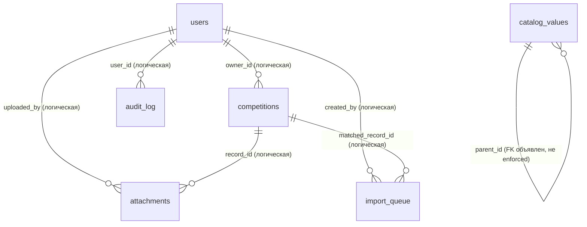

# Модель данных: текущее состояние

> Снимок актуален на **2026-09-20**, ревизия **88ce6d7** (ветка
> `feature/security-bundle`). Документ описывает **CURRENT STATE** — как база
> устроена и работает прямо сейчас, а не целевую архитектуру. История того,
> почему так решили, — в [data-model-decisions.md](data-model-decisions.md);
> этот документ — справочник «что есть».

Цель: новый инженер должен найти здесь ответ на любой вопрос о текущей схеме
и данных, не читая код. Все примеры синтетические.

## Как хранится база

- SQLite, файл `./data/competitions.sqlite3` (путь настраивается
  `DATABASE_PATH`), режим `journal_mode=WAL`.
- `PRAGMA foreign_keys` **везде выключен** — приложение его никогда
  не включает. Единственный объявленный в DDL внешний ключ
  (`catalog_values.parent_id`) — декларативный, без enforcement.
- `user_version = 0`, таблицы версий нет. Миграции — «самомиграция» при
  каждом старте: `_create_schema()` в `src/storage/sqlite.py` выполняет
  `CREATE TABLE IF NOT EXISTS` + аддитивные `ALTER TABLE ADD COLUMN`
  (полный список — в разделе «Миграции»).
- Одно соединение к БД + `threading.RLock` вокруг всех обращений
  (`check_same_thread=False`).
- Сверка с производственной базой (2026-09-20, read-only): **расхождений
  схемы нет** — DDL прода объект-за-объектом эквивалентен свежей инициализации
  той же ревизии; единственные текстовые отличия — безвредные артефакты
  накатанных `ALTER TABLE ADD COLUMN`.
- Объёмы прод-снимка (2026-09-20, только чтение): competitions 14, users 7,
  attachments 5, audit_log 207, calendar_events 2, catalog_values 22,
  levels 2, custom_fields 2, field_settings 10, import_queue 0.

## ER-диаграмма

Связи между таблицами — логические (в приложении), а не SQL-ограничения:
`PRAGMA foreign_keys` выключен, каскадов и ограничений целостности на уровне
БД нет. Исключение — самоссылка `catalog_values.parent_id`, объявленная
в DDL, но тоже не enforced.

Отдельная прикладная связь, которой нет в SQL:
`competitions.student_id = sha256(ФИО)`, где ФИО берутся из
`users.profile_data.student_name` и `users.name_aliases`. Хеши считаются
на лету (в приложении), в БД не хранятся — подробнее в разделе
«Как устроена личность сегодня».

## Таблицы

Общее: первичный ключ — `INTEGER PRIMARY KEY AUTOINCREMENT` (кроме
`field_settings`, где ключ — текстовый). Явные индексы в схеме — только два
частичных уникальных индекса `catalog_values` (см. ниже); остальных
индексов нет.

### 1. `competitions` — записи участий

Основная таблица: одна строка = одно участие одного студента в одном
соревновании.

| Колонка | Тип / ограничение | Смысл |
|---|---|---|
| `id` | PK AUTOINCREMENT | идентификатор записи |
| `student_id` | TEXT NOT NULL | `sha256(strip(ФИО))`, hex; ключ личности (см. ниже) |
| `student_name` | TEXT NOT NULL | ФИО открытым текстом (исторический факт) |
| `student_sex` | TEXT NOT NULL | пол |
| `institute` | TEXT NOT NULL | институт на момент соревнования |
| `group` | TEXT NOT NULL | группа (колонка в кавычках — зарезервированное слово) |
| `course` | INTEGER NOT NULL | курс; фактически `int \| str` — при текстовом типе поля хранит строку (кейс «Выпускник») |
| `sport` | TEXT NOT NULL | вид спорта |
| `date` | TEXT NOT NULL | дата соревнования, ISO; **начало** диапазона |
| `date_to` | TEXT NULL | конец диапазона; NULL = однодневное |
| `level` | TEXT NOT NULL | уровень; приводится к нижнему регистру и канонизируется |
| `name` | TEXT NOT NULL | название соревнования |
| `position` | INTEGER NOT NULL | место; 0 = «без результата» (при текстовом типе поля — строка) |
| `created_at` | TEXT NOT NULL | время создания, UTC |
| `extra_data` | TEXT NOT NULL DEFAULT `'{}'` | JSON значений кастомных полей, ключ = `custom_fields.key` |
| `review_status` | TEXT NOT NULL DEFAULT `'approved'` | `approved` / `pending` / `rejected` |
| `owner_id` | INTEGER NULL | логический FK `users.id`; обнуляется при удалении аккаунта |
| `review_comment` | TEXT NOT NULL DEFAULT `''` | комментарий модератора при отклонении |

Кто создаёт строки (везде через модель `Competition`):

- `POST /` — Excel-импорт: статус `approved`, `owner_id` = импортер;
- `POST /competition` — ручной ввод: атлет → `pending`,
  модератор (admin/editor) → `approved`;
- `POST /calendar/<id>/participants` — добавление участника события:
  `approved` (см. `calendar_events`);
- admin-решения по очереди импорта: accept/edit → `approved`,
  `owner_id` = автор импорта;
- `scripts/migrate_mongo_to_sqlite.py` — разовая миграция: `approved`,
  `owner_id` NULL.

### 2. `users` — аккаунты

| Колонка | Тип / ограничение | Смысл |
|---|---|---|
| `id` | PK AUTOINCREMENT | идентификатор аккаунта |
| `username` | TEXT NOT NULL UNIQUE | логин; без `:` и управляющих символов |
| `password_hash` | TEXT NOT NULL | `scrypt$N$r$p$salt_hex$digest_hex`, N=16384, r=8, p=1, dklen=32; параметры хранятся в самой строке |
| `role` | TEXT NOT NULL | `admin` / `editor` / `viewer` / `athlete` |
| `active` | INTEGER NOT NULL DEFAULT 1 | отключённая учётка не пускает вход |
| `pwd_ver` | INTEGER NOT NULL DEFAULT 0 | инкремент при смене пароля — ревокация активных сессий |
| `profile_data` | TEXT NOT NULL DEFAULT `'{}'` | JSON `{student_name, student_sex, institute, group, course}` (только непустые ключи), открытый текст; потребляется только ролью athlete |
| `name_aliases` | TEXT NOT NULL DEFAULT `'[]'` | JSON-массив ФИО открытым текстом; список только растёт |
| `last_login_at` | TEXT NULL | последний успешный вход |
| `last_seen_at` | TEXT NULL | активность; обновляется не чаще раза в 60 с (троттлинг) |

Кто создаёт строки: посев при старте из `AUTH_*`-переменных окружения
(`seed_users`; viewer опционален — при пустых переменных не создаётся)
и `POST /admin/users`. «Аккаунт без пароля» сегодня невозможен:
`password_hash NOT NULL`, а `verify_password` строго парсит scrypt-формат —
пустой/чужой хеш просто не пройдёт проверку.

### 3. `levels` — уровни соревнований

| Колонка | Тип / ограничение | Смысл |
|---|---|---|
| `id` | PK AUTOINCREMENT | |
| `name` | TEXT NOT NULL UNIQUE | значение; хранится в нижнем регистре |
| `sort_order` | INTEGER NOT NULL DEFAULT 0 | порядок в списках |
| `active` | INTEGER NOT NULL DEFAULT 1 | скрытое не показывается в подсказках |

Посев значений «внутривузовские»/«межвузовские» выполняется только при
пустой таблице. Управление — admin CRUD; при импорте справочник
синхронизируется автоматически:
`INSERT OR IGNORE ... SELECT DISTINCT level FROM competitions`.

### 4. `catalog_values` — справочники значений

Единая таблица для трёх справочников: категории различаются колонкой
`category`.

| Колонка | Тип / ограничение | Смысл |
|---|---|---|
| `id` | PK AUTOINCREMENT | |
| `category` | TEXT NOT NULL | `sport` / `institute` / `group` |
| `value` | TEXT NOT NULL | значение (текст) |
| `parent_id` | INTEGER NULL, REFERENCES `catalog_values(id)` | для `group` — родительский институт; **единственный объявленный FK в схеме**, enforcement выключен |
| `active` | INTEGER NOT NULL DEFAULT 1 | скрытое не показывается в подсказках |
| `created_at` | TEXT NOT NULL | |

Единственные явные индексы схемы — два частичных уникальных:

- `idx_catalog_values_flat (category, value) WHERE parent_id IS NULL` —
  плоские значения (спортив, институты);
- `idx_catalog_values_child (category, parent_id, value) WHERE parent_id IS NOT NULL` —
  дочерние; одноимённые группы разных институтов сосуществуют.

Наполнение — `INSERT OR IGNORE` из записей, импорта и admin-роутов;
скрытые (active=0) значения при повторном появлении в записях не «оживают».
Справочники — только подсказки (datalist) в формах: значения в существующих
записях не валидируются и не перезаписываются.

### 5. `custom_fields` — кастомные поля

Определения дополнительных колонок записей. Управление — только admin.
Сами значения хранятся не здесь, а в `competitions.extra_data[key]`.

| Колонка | Тип / ограничение | Смысл |
|---|---|---|
| `id` | PK AUTOINCREMENT | |
| `key` | TEXT NOT NULL UNIQUE | ключ; нормализуется из label |
| `label` | TEXT NOT NULL | отображаемое название |
| `field_type` | TEXT NOT NULL DEFAULT `'text'` | `text` / `number` / `date` / `url` |
| `required` | INTEGER NOT NULL DEFAULT 0 | обязательность при вводе/импорте |
| `show_in_table` | INTEGER NOT NULL DEFAULT 1 | показ в таблице |
| `show_in_export` | INTEGER NOT NULL DEFAULT 1 | показ в выгрузках |
| `show_in_template` | INTEGER NOT NULL DEFAULT 1 | показ в пустом шаблоне импорта |
| `sort_order` | INTEGER NOT NULL DEFAULT 0 | порядок |
| `active` | INTEGER NOT NULL DEFAULT 1 | отключённое поле скрывается |
| `link_target` | TEXT NULL | у `url`-полей: ключ колонки, которую значение гиперссылает; догоняющая миграция |

### 6. `field_settings` — настройки базовых полей

«Лёгкий реестр полей»: тип и обязательность десяти базовых колонок записи.

| Колонка | Тип / ограничение | Смысл |
|---|---|---|
| `key` | TEXT PRIMARY KEY | имя базового поля (10 штук: student_name, student_sex, institute, group, sport, date, level, name, position, course) |
| `value_type` | TEXT NOT NULL DEFAULT `'text'` | `text` / `number` |
| `required` | INTEGER NOT NULL DEFAULT 0 | обязательность |

`student_name` и `date` принудительно обязательны в коде
(`ALWAYS_REQUIRED_BASE_FIELDS`) — настройка их не ослабляет. Дефолты
дописываются `INSERT OR IGNORE` при каждом старте; изменение — upsert
из `POST /admin/fields/base`.

### 7. `attachments` — вложения

| Колонка | Тип / ограничение | Смысл |
|---|---|---|
| `id` | PK AUTOINCREMENT | |
| `record_id` | INTEGER NOT NULL | логический FK `competitions.id` |
| `filename` | TEXT NOT NULL | исходное имя файла от пользователя |
| `stored_name` | TEXT NOT NULL | имя на диске: `uuid4().hex` + расширение |
| `content_type` | TEXT NOT NULL | `pdf` / `png` / `jpeg`; проверяется и расширение, и сигнатура (magic bytes) |
| `size` | INTEGER NOT NULL | размер в байтах (лимит 5 МБ на уровне приложения) |
| `uploaded_by` | INTEGER NULL | логический FK `users.id` |
| `created_at` | TEXT NOT NULL | |

Файлы лежат в `data/files/<record_id>/<stored_name>`. Создание —
`POST /competition/<id>/attachments` (роли с правом записи, владелец
записи). С ревизии 88ce6d7 удаление записи удаляет и строки вложений
(одной транзакцией с записью), и файлы на диске (best-effort).

### 8. `audit_log` — журнал аудита

| Колонка | Тип / ограничение | Смысл |
|---|---|---|
| `id` | PK AUTOINCREMENT | |
| `created_at` | TEXT NOT NULL | |
| `user_id` | INTEGER NULL | логический FK `users.id`; может быть NULL |
| `username` | TEXT NOT NULL | логин текстом — переживает удаление аккаунта |
| `action` | TEXT NOT NULL | код события (ниже) |
| `details` | TEXT NOT NULL DEFAULT `''` | параметры события |

Таблица append-only: `UPDATE`/`DELETE` в коде отсутствуют. Фиксируемые
действия:

- `login_success` / `login_failed` — входы;
- `password_changed` — смена пароля;
- `record_approved` (в т.ч. авто-подтверждение при правке модератора) /
  `record_rejected` — решения модерации;
- `students_merged` — merge ФИО;
- `alias_added` — привязка псевдонима;
- `user_deleted` — удаление аккаунта;
- `import_conflict_resolved` — решения по очереди импорта
  (accepted/skipped/replaced, с diff);
- `catalog_value_renamed` / `catalog_value_deleted` — справочники;
- `calendar_event_deleted` — удаление события календаря;
- `field_settings_changed` — настройки базовых полей;
- `db_wiped` / `pre_wipe_archive_created` — очистка базы и страховочный
  архив перед ней;
- `backup_created` — бэкап (по таймеру или вручную).

### 9. `calendar_events` — календарь соревнований

Событие календаря — **пресет** для будущих записей, а не контейнер
участников: участников событие не хранит.

| Колонка | Тип / ограничение | Смысл |
|---|---|---|
| `id` | PK AUTOINCREMENT | |
| `name` | TEXT NOT NULL | название |
| `date` | TEXT NOT NULL | начало, ISO |
| `date_to` | TEXT NULL | конец; NULL = однодневное |
| `level` | TEXT NOT NULL DEFAULT `''` | |
| `sport` | TEXT NOT NULL DEFAULT `''` | |
| `url` | TEXT NOT NULL DEFAULT `''` | только `http://` или `https://` (с 88ce6d7) |
| `created_at` | TEXT NOT NULL | |

Участники события **вычисляются**: JOIN записей реестра по пресету
`(name, date, COALESCE(date_to, ''))` против `competitions`. Добавление
участника создаёт обычную `approved`-запись с пресетом события
(`position = 0`, «ждёт результата»). Удаление события заблокировано, если
по пресету уже есть совпавшие записи.

### 10. `import_queue` — очередь конфликтов импорта

| Колонка | Тип / ограничение | Смысл |
|---|---|---|
| `id` | PK AUTOINCREMENT | |
| `created_at` | TEXT NOT NULL | |
| `payload_json` | TEXT NOT NULL | JSON строки импорта (модель `Competition`: ключи полей, ISO-даты, `extra_data`, уже посчитанный `student_id`) |
| `status` | TEXT NOT NULL DEFAULT `'pending'` | `pending` / `accepted` / `skipped` / `replaced` |
| `matched_record_id` | INTEGER NULL | похожая существующая запись; NULL = конфликт между строками одного файла |
| `created_by` | INTEGER NULL | логический FK `users.id`; при accept/edit становится `owner_id` записи |

Строки создаёт только Excel-импорт («похожие» строки, см. ниже).
Разбирают очередь admin-роуты; любое действие доступно только при
`status = 'pending'`, иначе 409.

## Как устроена личность сегодня

Отдельной сущности «студент»/«атлет» в базе **нет**. Человек в системе —
это:

1. колонки каждой строки `competitions` — исторический факт участия
   (ФИО, группа, институт, курс на момент соревнования; сменой профиля
   не перезаписываются);
2. `users.profile_data` — текущие данные (ФИО, пол, институт, группа,
   курс); потребляются только ролью athlete (автоподстановка в формы).

Идентификация записей между собой — только через
`student_id = sha256(strip(ФИО))`:

- точное строковое равенство после `strip()`: регистр, «ё/е», внутренние
  пробелы и любые другие вариации написания значимы — другое написание
  это другой `student_id`, то есть «другой человек»;
- стабильного суррогатного ID личности нет: есть только `users.id`
  аккаунта (если он есть) и детерминированный хеш ФИО;
- тёзки (полностью одинаковые ФИО разных людей) не различаются —
  задокументированное решение (см. data-model-decisions.md, «Тёзки»).

Кабинет атлета собирается запросом:
`owner_id = <uid> OR student_id IN (<хеши profile_data.student_name и
каждого name_aliases>)`. Хеши считаются приложением на лету и нигде в БД
не хранятся. Роли viewer/editor/admin записей «по ФИО» не видят — для них
существует только общий реестр.

Merge (admin, смена фамилии): переписывает `student_id` (и по умолчанию
отображаемое `student_name`) у записей со старым хешем и дописывает новое
ФИО в `name_aliases` затронутых аккаунтов. Список псевдонимов только
растёт — ничего не удаляется.

## Импорт Excel и дедупликация

- Полный ключ дубля: `(student_name, date.isoformat(), sport, name)`.
  `date_to` в ключ **не входит**.
- Частичный ключ: `(student_name, date)`. Если полный ключ не совпал,
  а частичный совпал — строка не вставляется, а попадает в `import_queue`
  на решение админа.
- Вставка — одной транзакцией: записи + посев справочников (`sport`,
  `institute`, пары институт→группа, `levels`) SELECT'ами из вставленного;
  при сбое откатывается всё.
- Дедупликация — на уровне записей, **не людей**: написание ФИО иначе
  обходит её (см. «личность»).
- Импорт **никогда** не создаёт пользователей, профилей и аккаунтов
  (`create_user` вызывается только посевом `AUTH_*` и `/admin/users`).
- Все импортируемые строки получают `review_status = 'approved'`,
  `owner_id` = импортер.

Решения по очереди конфликтов (только для `pending`):

- **accept** — вставить (с повторной дедупликацией на момент клика);
- **skip** — пропустить;
- **replace** — данные кандидата затирают существующую запись;
  `owner_id` и статус не меняются; в аудите пишется diff;
- **edit** — правка всех полей, кроме ФИО и даты (они приходят из payload),
  затем вставка как accept.

## Модерация

- Атлет создаёт или правит запись → `pending`.
- Правка модератором (admin/editor) → `approved` (фиксируется в аудите
  как `record_approved` с признаком авто).
- Ручные решения: approve / reject (reject — с комментарием
  в `review_comment`).
- Отчёты и большинство выборок показывают только `approved`.

## Миграции

Механизм: при каждом старте `_create_schema()` доводит базу до актуальной
схемы; всё идемпотентно. Полный список накатываемых изменений:

- `competitions`: `+extra_data`, `+review_status`, `+owner_id`,
  `+review_comment`, `+date_to`;
- `custom_fields`: `+link_target`;
- `catalog_values`: реструктуризация в `parent_id`-схему — единственная
  пересборка таблицы (данные копируются, легаси-таблица дропается);
- `users`: `+pwd_ver`, `+profile_data`, `+name_aliases`, `+last_login_at`,
  `+last_seen_at`;
- новые таблицы целиком через `CREATE TABLE IF NOT EXISTS`
  (`attachments`, `levels`, `catalog_values`, `users`, `audit_log`,
  `calendar_events`, `field_settings`, `import_queue`);
- populate-шаги: дефолты `field_settings`, наполнение справочников из
  записей — `INSERT OR IGNORE`.

## Открытые продуктовые вопросы

Перечислены без проектирования — это вопросы к будущим решениям,
не часть текущей модели:

1. Главный: **как идентифицировать студента при импорте списка студентов
   и соревнований, учитывая опечатки, однофамильцев и одинаковые
   инициалы.** Проектирование — отдельным циклом после фиксации текущего
   состояния (этот документ).
2. Нужна ли отдельная сущность «студент» со стабильным ID вместо
   `sha256(ФИО)`.
3. Нормализация ключа личности (регистр, ё/е, пробелы) — менять ли и что
   делать с историческими данными.
4. Как различать тёзок (одинаковые ФИО разных людей).
5. «Аккаунт существует, пароль не выдан» — какую модель выбрать
   (nullable `password_hash` / sentinel / отдельный статус), если такая
   роль понадобится.
6. Связь записей с календарём через пресет (`name + date + date_to`) —
   достаточно ли этого или нужен явный link (правка пресета меняет состав
   участников без каскадов).
7. Включать ли `PRAGMA foreign_keys` (сейчас все связи логические).

## Известные пробелы / бэклог

- README в разделе «Возможности» не упоминает календарь соревнований.
- На производственной базе есть 5 «осиротевших» вложений (строки без
  соответствующих записей) — ждут отдельной cleanup-задачи.
- Косметика: docstring `ensure_catalog_values` в `src/main.py` ссылается
  на несуществующий метод storage (`SQLiteAdapter._ensure_import_catalogs`).
